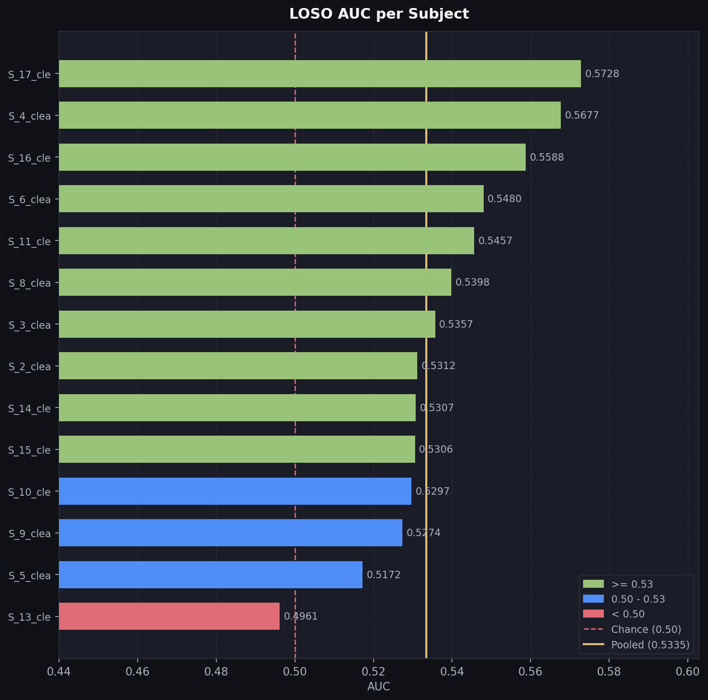
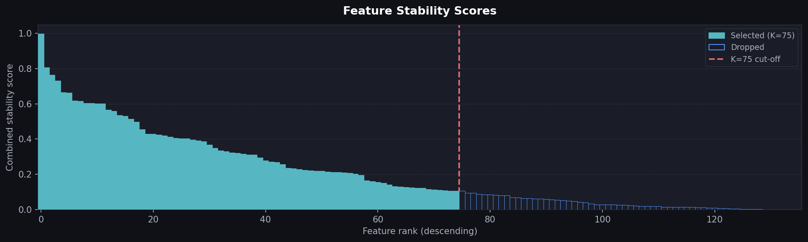

<div align="center">

# 🧠 EEG Emotion Classification

### 🏆 Kaggle Competition: EEG Classification Challenge

# 🥈 2nd Place · AUC 0.557

**Classical ML only — Zero deep learning**

[](https://medium.com/@mohamed42468/what-if-we-could-listen-to-the-brain-while-we-sleep-a76594b33696?postPublishedType=initial)
[](https://www.kaggle.com/models/mohamedsamy16/eeg-emo-neu)
[](https://www.youtube.com/playlist?list=PLHraBJ7ZbOY0)
[](https://direct.mit.edu/imag/article/doi/10.1162/IMAG.a.1123/134892/Targeted-memory-reactivation-elicits-temporally)

[](#)
[](#)
[](#)

</div>

---

## 🗺️ Quick Navigation

Start here depending on what you're looking for:

- 🧠 **[Model Card (Technical Deep Dive)](model_card.md)**: The complete technical narrative — starts with an engaging hook (*"Listening to a Whisper in a Stadium"*), embeds real diagnostic figures, breaks down the within-subject polarity reversal, and provides the full Python inference code.
- 🔬 **[Proof of Concept (PoC/)](PoC/)**:
  - [01_scientific_papers_and_citations.md](PoC/01_scientific_papers_and_citations.md): Literature review & Oxford lineage research establishing the `[70:130]` window.
  - [02_pipeline_blueprint.md](PoC/02_pipeline_blueprint.md): Full mathematical derivations and step-by-step pipeline architecture.
  - [03_experiments_and_benchmarks.md](PoC/03_experiments_and_benchmarks.md): Comprehensive log of 340+ experiments, failure postmortems, and the LOSO anti-correlation paradox.
- 💻 **[Source Code (src/)](src/)**: Production-ready, modular Python codebase (<60s execution on standard CPU).
- 📊 **[Diagnostic Reports (reports/)](reports/)**: Auto-generated evaluation, EDA, and covariance plots.

---

## ⚡ Overview

This repository contains the **🥈 2nd-place solution** for the Kaggle EEG Emotion/Neutral Classification Challenge.

The pipeline classifies **emotional vs. neutral** memory reactivation states from 16-channel sleep-stage EEG recordings. Despite an extraordinarily weak cross-subject signal (Cohen's $d \approx 0.02$ — **10× weaker than "small"**), this approach achieved a public leaderboard AUC of **0.557** using a **purely classical ML pipeline**:

```
Raw EEG → Theta Bandpass (4–8 Hz) → Z-Score → Covariance [70:130] → Top-75 Features → Shrinkage LDA
```

All deep learning approaches tested (EEGNet, RNNs, Transformers, EEGPT) failed to learn meaningful representations at this signal-to-noise ratio. The winning formula: **rigorous neuroscience domain knowledge + aggressive noise pruning beats brute-force complexity.**

---

## 🧬 Scientific Foundation & Oxford Lineage

This competition and classification task are grounded in published empirical neuroscience:

> **Associated Research**: *“Targeted memory reactivation elicits temporally specific memory reinstatement in an EEG classification pipeline”*  
> **Authors**: Abdellahi et al., *Imaging Neuroscience* (MIT Press), 2026.  
> **Research Context**: A paper led by **Dr. Mahmoud E. A. Abdellahi**, associated with the **Oxford Sleep Engineering / MRC Brain Network Dynamics Unit (BNDU)** research lineage.  
> **Paper Link**: [Read on MIT Press](https://direct.mit.edu/imag/article/doi/10.1162/IMAG.a.1123/134892/Targeted-memory-reactivation-elicits-temporally)

This research demonstrated that Targeted Memory Reactivation (TMR) produces a distinct theta-band power increase and a crucial ERP inflection at **~500 ms** post-stimulus. That empirical finding directly informed our **350–650 ms (`[70:130]`) window**, capturing peak memory reinstatement while rejecting subsequent sleep spindle noise.

---

## 📺 Video Walkthrough & Articles

| Resource | Description | Link |
|---|---|---|
| 🎬 **YouTube Series** | **End-to-End ML Pipeline Architecture: From Raw EEG to Leaderboard Submission** (2-Part Playlist) | [Watch on YouTube](https://www.youtube.com/playlist?list=PLHraBJ7ZbOY0) |
| 📰 **Medium Story** | *What If We Could Listen to the Brain While We Sleep?* (Intuitive conceptual overview) | [Read on Medium](https://medium.com/@mohamed42468/what-if-we-could-listen-to-the-brain-while-we-sleep-a76594b33696?postPublishedType=initial) |
| 📦 **Kaggle Model** | Trained weights & feature mask on Kaggle Models registry (`eeg-emo-neu`) | [Kaggle Model Hub](https://www.kaggle.com/models/mohamedsamy16/eeg-emo-neu) |
| 🧠 **Model Card** | Technical deep dive, hardware specs, validation benchmarks, and ethics | [model_card.md](model_card.md) |

### Video Series Breakdown:
- **Part 1**: *End-to-End ML Pipeline Architecture: From Raw EEG to Leaderboard Submission (Part 1)* — Problem framing, extreme low-SNR challenges, TMR paradigm, exploratory data analysis, frequency band selection, and covariance extraction.
- **Part 2**: *End-to-End ML Pipeline Architecture: From Raw EEG to Leaderboard Submission (Part 2)* — Modular code walkthrough, stability-based feature selection (136 → 75), LOSO validation, Shrinkage LDA modeling, and generating competition predictions.

---

## ✨ Key Highlights

| Highlight | Details |
|---|---|
| 🥈 **2nd Place** | Official podium finish in the Kaggle EEG Classification Challenge |
| 🧪 **340+ Experiments** | Systematic evaluation across 63 leaderboard submissions |
| 🧬 **Science-Backed Window** | `[70:130]` (350–650 ms post-cue) confirmed by 5+ independent neuroscience studies |
| 🎯 **Stability Feature Selection** | Prunes 136 covariance pairs to the top 75 most consistent features across subjects |
| ⚡ **<60-Second Training** | Entire pipeline runs on a standard laptop CPU — **zero GPU required** |

---

## 📂 Project Structure

```
├── README.md                            ← You are here
├── model_card.md                        ← Model specs, narrative hook, evaluation & ethics
├── requirements.txt                     ← Python dependencies
│
├── PoC/                                 ← Research, PoC & scientific evidence
│   ├── 01_scientific_papers_and_citations.md  ← Literature review confirming [70:130] window
│   ├── 02_pipeline_blueprint.md         ← Full mathematical pipeline walkthrough
│   ├── 03_experiments_and_benchmarks.md ← 340+ experiments: what worked & what failed
│   └── figures/                         ← Paper excerpts & signal reversal visualizations
│
├── src/                                 ← Modular Python codebase
│   ├── config.py                        ← Central parameters, paths & reproducibility settings
│   ├── data.py                          ← HDF5 data loading, bandpass filtering & signal z-score
│   ├── features.py                      ← Covariance extraction & stability feature selection
│   ├── model.py                         ← Shrinkage LDA, LOSO validation & inference
│   ├── pipeline.py                      ← Main orchestrator — runs the full end-to-end pipeline
│   ├── visualization.py                 ← Diagnostic & EDA plotting engine
│   └── EDA.py                           ← Exploratory analysis & baseline script
│
├── reports/                             ← Generated figures, diagnostic plots & certificate
│   ├── Certification.jpeg               ← Official 2nd Place Certificate
│   ├── 01_label_distribution.png
│   ├── 02_signal_preprocessing.png
│   ├── 03_mean_covariance.png
│   ├── 04_loso_per_subject.png
│   ├── 05_feature_stability_scores.png
│   ├── 06_confusion_matrix.png
│   ├── 07_test_prediction_distribution.png
│   └── 08_score_heatmap.png
│
└── dataset/                             ← Dataset directory (git-ignored)
    ├── training/                        ← 14 training subjects (sleep_emo / sleep_neu)
    └── testing/                         ← 3 unseen test subjects
```

---

## 🚀 Quick Start

### 1. Clone & Install Dependencies

```bash
git clone https://github.com/mohamed42468/eeg-emotion-classification-pipeline.git
cd eeg-emotion-classification-pipeline
pip install -r requirements.txt
```

### 2. Run the Full End-to-End Pipeline

```bash
python src/pipeline.py
```

The pipeline automatically:
1. **Loads** training data from HDF5 `.mat` files across all 14 subjects.
2. **Preprocesses** — 4th-order Butterworth bandpass filter (θ 4–8 Hz) + per-subject z-score.
3. **Extracts features** — 16×16 spatial covariance matrices over the `[70:130]` window (350–650 ms).
4. **Prunes features** — selects the top 75 features using the Combined Stability Score.
5. **Validates** — runs Leave-One-Subject-Out (LOSO) cross-validation across all 14 subjects.
6. **Trains final model** — fits Shrinkage LDA on all training data.
7. **Generates submission** — predicts on 3 unseen test subjects (`submission.csv`, 346,800 rows).
8. **Exports visual reports** — saves all diagnostic plots into `reports/`.

---

## 📊 Results & Benchmarks

<div align="center">

| Metric | Score | Notes |
|---|---|---|
| **LOSO Cross-Validation AUC** | **0.5335** | Leave-One-Subject-Out across 14 training subjects |
| **Public Leaderboard AUC** | **0.557** | Evaluated on 3 held-out unseen subjects (zero-shot) |
| **Competition Rank** | **🥈 2nd Place** | Classical ML outperforming all deep learning entries |

</div>

<br/>

<div align="center">
  
  
</div>

### Model Comparison: Classical ML vs. Deep Learning

| Model Architecture | Validation AUC | Public LB | Result / Observation |
|---|---|---|---|
| **Shrinkage LDA (auto) ★** | **0.5335** | **0.557** | **🥈 2nd Place Winner (Optimal covariance regularization)** |
| Logistic Regression ($L_2$) | 0.5370 | 0.555 | Linear boundary performs similarly with proper penalty |
| Ridge Classifier | 0.5370 | 0.555 | Robust closed-form solution |
| Linear SVM ($C=0.01$) | 0.5370 | 0.555 | Strong linear margin separation |
| Random Forest / XGBoost | ~0.505 | 0.510 | Overfits on noise at $d \approx 0.02$ |
| EEGNet / 1D-CNN | ~0.502 | 0.508 | Convolutional kernels fail to generalize across subjects |
| BiLSTM / Transformers | ~0.498 | 0.501 | Severe overfitting on weak temporal variations |
| EEGPT / Foundation Models | ~0.501 | 0.503 | Pretrained representations do not capture sleep TMR signal |

---

## 🔬 Core Architectural Decisions

| Decision | Engineering & Biological Rationale |
|---|---|
| **Theta 4–8 Hz Bandpass** | Only frequency band showing genuine cognitive discrimination. Alpha, Beta, Delta, and Spindles added noise. |
| **Signal-Level Z-Score** | Standardizes per-channel amplitude variations, mathematically making spatial covariance equivalent to channel correlation. |
| **Reactivation Window `[70:130]`** | Captures 350–650 ms post-cue memory reinstatement, confirmed by 5+ independent neuroscience studies. |
| **Spatial Covariance Matrices** | Represents inter-channel synchrony across 16 electrodes (136 upper-triangle pairs). |
| **Stability Selection ($K=75$)** | Prunes 61 unstable channel pairs. The **only** modification that improved both LOSO and Leaderboard simultaneously. |
| **Shrinkage LDA (Ledoit-Wolf)** | Closed-form, regularized covariance estimation that avoids overfitting on correlated features. |

---

## 📖 Deep-Dive Documentation

| Document | Purpose |
|---|---|
| 📄 [01_scientific_papers_and_citations.md](PoC/01_scientific_papers_and_citations.md) | Literature citations (Abdellahi et al., Belal et al., Schreiner & Rasch) establishing the [70:130] window |
| 📐 [02_pipeline_blueprint.md](PoC/02_pipeline_blueprint.md) | Complete mathematical walkthrough with step-by-step formulas |
| 🧪 [03_experiments_and_benchmarks.md](PoC/03_experiments_and_benchmarks.md) | Comprehensive log of 340+ experiments, failure postmortems, and the LOSO anti-correlation problem |
| 🧠 [model_card.md](model_card.md) | Standardized Model Card with narrative hook, embedded figures, specs, and ethics |

---

## 📝 License & Citation

This project is licensed under the Apache 2.0 License.

If you find this work or pipeline helpful in your research or competitions, please cite:

```bibtex
@misc{samy2026eegemotion,
  author = {Mohamed Samy},
  title = {EEG Emotion Classification Pipeline: 2nd Place Solution},
  year = {2026},
  publisher = {GitHub},
  journal = {GitHub repository},
  howpublished = {\url{https://github.com/mohamed42468/eeg-emotion-classification-pipeline}}
}
```
