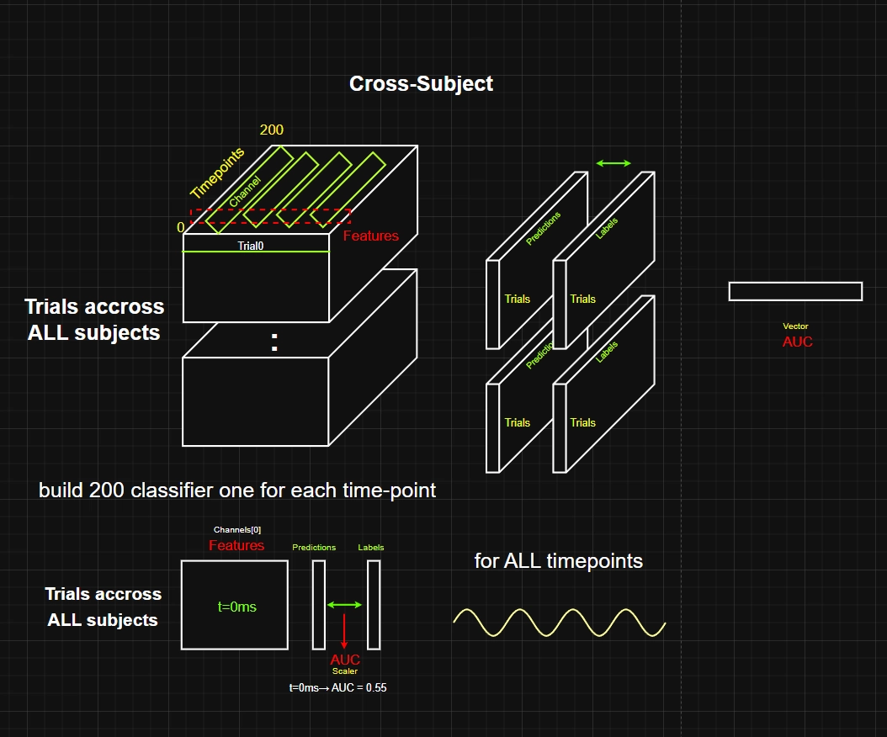
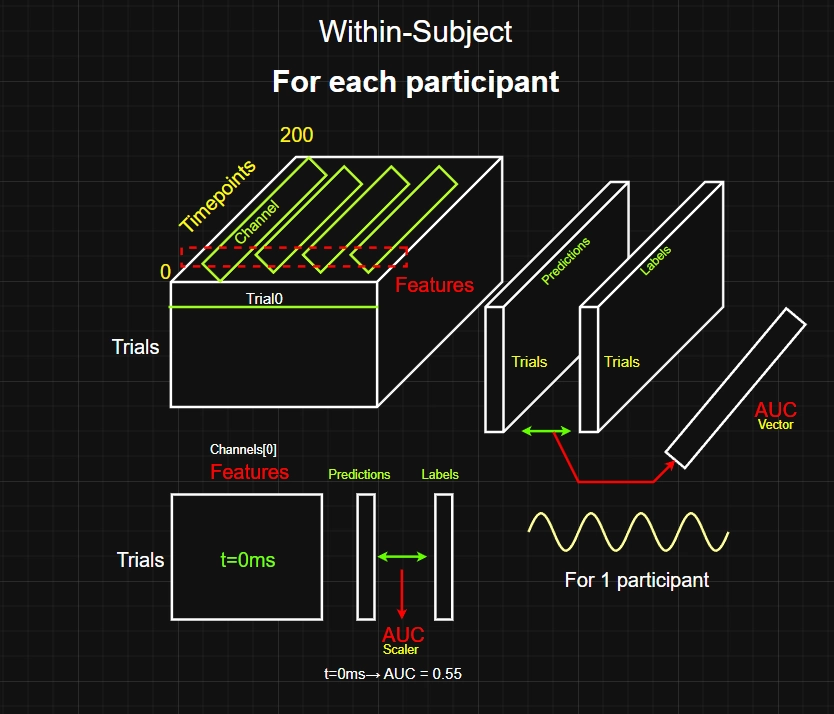

# EEG Sleep Emotion Classification — Pipeline Architecture

> **Competition**: Kaggle EEG Emotion/Neutral Classification  
> **Result**: Public LB AUC = **0.557** · Rank **4th**  
> **Evidence base**: 340+ LOSO experiments · 63 LB submissions  
> **Related docs**: [Experiment Log](./02_experiment_log.md) · [Window Evidence](./03_window_evidence.md)

---

## 1 · Competition Overview

| Item | Value |
|------|-------|
| **Task** | Binary classification — Emotional vs Neutral memory reactivation from sleep EEG |
| **Data** | 16 channels × 200 timepoints (1 s at 200 Hz) per trial |
| **Training** | 14 subjects · 10,209 trials (5,038 emo + 5,171 neu) |
| **Test** | 3 unseen subjects · zero-shot (S18 = 372, S19 = 479, S20 = 883 trials) |
| **Metric** | Window-based AUC — longest sustained > 0.5 window (≥ 50 ms), then mean AUC |
| **Submission** | 346,800 rows: `{subject}_{trial}_{timepoint}, prediction` |

**Label mapping**: Raw labels use `condition 0 = emo, 1 = neu`.  
We invert: **`y = 1 − condition`** so that `emo = 1, neu = 0`.

**Prediction column**: `predict_proba(X)[:, 1]` → P(emotional).  
Using `[:, 0]` silently outputs 0.500 everywhere.

---

## 2 · The Signal — What We're Working With

### 2.1 · It's Extremely Weak

The cross-subject emotional signal is among the weakest in EEG research:

| Signal Type | Cohen's d | Interpretation |
|-------------|-----------|----------------|
| Cross-subject (what we classify) | **0.02 – 0.06** | Tiny (0.2 = "small") |
| Within-subject | 0.3 – 0.5 | 5–7× stronger, but **flips direction** across subjects |



### 2.2 · Signal Direction Reversal (Fundamental Problem)

The within-subject signal is stronger but its **direction reverses** across individuals — making it unusable for a cross-subject model:

| Group | Direction | Subjects | Count |
|-------|-----------|----------|-------|
| **A** | emo > neu | S0, S2, S3, S4, S6, S7, S8, S10 | 8 |
| **B** | emo < neu | S1, S5, S9, S11, S12, S13 | 6 |



A global model averages these opposing patterns → performance collapses toward chance. There is no reliable way to detect which group a new subject belongs to without labels.

### 2.3 · Only Theta Band Works

| Band | LOSO AUC | Status |
|------|----------|--------|
| **Theta 4–8 Hz** | **0.5250** | ✅ Only useful band |
| Gamma 30+ Hz | 0.5109 | ❌ |
| Alpha 8–12 Hz | 0.504 | ❌ |
| Broadband 1–30 Hz | 0.5005 | ❌ |
| Spindle 12–15 Hz | 0.4973 | ❌ |
| Delta 1–4 Hz | 0.4936 | ❌ |

> Multi-band stacking **always** hurts. Theta alone is optimal.

### 2.4 · Only One Time Window Works

**Optimal: `[70:130]` = 350–650 ms** post-cue (peak at 500–600 ms).

| Window | Time (ms) | LOSO AUC | LB | Notes |
|--------|-----------|----------|----|-------|
| `[0:200]` | 0–1000 | 0.5120 | 0.517 | Full window — worst |
| **`[70:130]` ★** | **350–650** | **0.5218** | **0.551** | **Best balance** |
| `[80:120]` | 400–600 | 0.5264 | — | Best LOSO but LB worse |
| `[50:150]` | 250–750 | 0.5151 | — | Wider = more noise |

This window is backed by **5+ independent neuroscience studies**. See [Window Evidence](./03_window_evidence.md).

---

## 3 · Pipeline Architecture — Step by Step

```
┌─────────────┐    ┌──────────────┐    ┌──────────────┐    ┌──────────────┐
│  Raw EEG    │───▶│  Bandpass    │───▶│  Z-Score     │───▶│  Window      │
│  16ch×200tp │    │  θ 4–8 Hz   │    │  per subject │    │  [70:130]    │
└─────────────┘    └──────────────┘    └──────────────┘    └──────┬───────┘
                                                                  │
┌─────────────┐    ┌──────────────┐    ┌──────────────┐    ┌──────▼───────┐
│  Broadcast  │◀───│  Shrinkage   │◀───│  Select      │◀───│  Covariance  │
│  200 tp     │    │  LDA         │    │  Top K=75    │    │  16×16 → 136 │
└──────┬──────┘    └──────────────┘    └──────────────┘    └──────────────┘
       │
       ▼
  submission.csv
```

---

### Step 1 · Load Raw EEG

```
Input:  HDF5 .mat files → (trials × 16 channels × 200 timepoints)
Output: X_all (10,209 × 16 × 200), y_all (10,209,)
```

Load training data from `sleep_emo/` and `sleep_neu/` directories. Each subject has a pair of `.mat` files. Concatenate all subjects, tracking per-subject boundaries for later normalization.

---

### Step 2 · Bandpass Filter — Theta 4–8 Hz

```
Filter:  4th-order Butterworth, zero-phase (filtfilt)
Applied: per trial, per channel
```

Zero-phase filtering (`filtfilt`) applies the filter forward then backward — no phase distortion. This isolates the theta rhythm where the emotional reactivation signal lives.

**Why theta?** Theta oscillations (4–8 Hz) are associated with memory reactivation during NREM sleep. All other bands tested at or below chance level.

---

### Step 3 · Z-Score Normalization (Signal Level)

```
For each subject independently:
    μ = mean across all trials (per channel, per timepoint)
    σ = std across all trials
    X_normalized = (X − μ) / σ
```

**Why this matters for covariance:**

Standard correlation is defined as:

```
correlation(A, B) = covariance(A, B) / (σ_A × σ_B)
```

After z-scoring, each channel has σ = 1. Therefore:

```
covariance(A, B) / (1 × 1) = correlation(A, B)
```

**The signal-level z-score makes covariance mathematically equivalent to correlation** — removing subject-specific amplitude differences while preserving the relational structure between channels.

---

### Step 4 · Extract Time Window `[70:130]`

```
Input:  (trials × 16 × 200)
Window: timepoints 70–130 → 350–650 ms post-cue
Output: (trials × 16 × 60)
```

This window captures the peak memory reactivation response — backed by 5+ independent TMR studies. Including timepoints outside this range adds noise:

- **0–350 ms**: Auditory processing (hearing the sound cue)
- **650–1000 ms**: Sigma/spindle consolidation (different mechanism)

---

### Step 5 · Compute Covariance Matrix

```
For each trial:
    cov[i,j] = (1/W) × Σ_t  X[channel_i, t] × X[channel_j, t]

Using einsum:  covs = np.einsum('ijk,ilk->ijl', X_win, X_win) / win_size
Output: (trials × 16 × 16)
```

Each cell in the 16×16 matrix answers: *"During this 300 ms window, how much did channel i and channel j move together?"*

**Example — two channels:**

```
Channel O1:  [0.3, 0.5, 0.8, 0.6, 0.4, ...]  → 60 values
Channel Pz:  [0.3, 0.5, 0.7, 0.6, 0.3, ...]  → 60 values

O1 × Pz:    t=70: 0.09,  t=71: 0.25,  t=72: 0.56, ...

Average all 60 products → one scalar
→ "How synchronized were O1 and Pz during this window?"
```

**Full matrix interpretation:**

```
        O1    Pz    F3    C3
O1   [ 1.2   0.8   0.1   0.3 ]  ← O1 vs everyone
Pz   [ 0.8   1.5   0.2   0.4 ]  ← symmetric
F3   [ 0.1   0.2   0.9   0.1 ]
C3   [ 0.3   0.4   0.1   1.1 ]
```

- **High value** (e.g. O1–Pz = 0.8): These brain regions are highly synchronized
- **Low value** (e.g. O1–F3 = 0.1): These regions are operating independently

---

### Step 6 · Extract Upper Triangle → 136 Features

```
The covariance matrix is symmetric (cov[i,j] = cov[j,i])
Upper triangle including diagonal: (16 × 17) / 2 = 136 unique values
```

```
        O1    Pz    F3    C3
O1   [ 1.2   0.8   0.1   0.3 ]  ← keep all
Pz   [  ×    1.5   0.2   0.4 ]  ← keep from diagonal
F3   [  ×     ×    0.9   0.1 ]  ← keep from diagonal
C3   [  ×     ×     ×    1.1 ]  ← diagonal only
```

---

### Step 7 · Z-Score Features (Feature Level)

```
For each subject independently:
    Normalize each of the 136 features to mean=0, std=1
```

> **This is NOT the same as Step 3.** Step 3 normalizes raw signals to make covariance ≈ correlation. This step normalizes the extracted features so that LDA is not dominated by features with large numerical ranges.

| Z-Score | Applied To | Purpose | Makes cov ≈ corr? |
|---------|-----------|---------|-------------------|
| **Step 3** (signal) | Raw EEG channels | Remove subject amplitude differences | ✅ Yes |
| **Step 7** (feature) | 136 cov features | Scale features for LDA | ❌ No — just scaling |

---

### Step 8 · Feature Selection — Combined Stability Score

This is the **key innovation** that improved both LOSO and LB (the only method to do so). For each of the 136 features, we measure how *stable* its LDA coefficient is across all LOSO folds.

**Step 8a — Build coefficient matrix** (one LDA per LOSO fold):

| Fold | Left Out | F0 | F1 | F2 | F3 | F4 |
|------|----------|-------|-------|-------|-------|-------|
| 0 | S1 | +0.82 | +0.71 | +0.65 | +0.08 | +0.30 |
| 1 | S2 | +0.79 | +0.68 | +0.60 | −0.06 | −0.28 |
| 2 | S3 | +0.85 | +0.73 | +0.58 | +0.09 | −0.31 |
| 3 | S4 | +0.80 | +0.69 | −0.12 | +0.05 | +0.27 |

**Step 8b — Compute three metrics per feature:**

**① Sign Agreement** — *"Do all folds agree on the direction?"*

```
F0: signs = [+,+,+,+] → mean = +1.0 → |1.0| = 1.0  ✅ Perfect
F4: signs = [+,−,−,+] → mean =  0.0 → |0.0| = 0.0  ❌ Terrible
```

**② Mean Absolute Coefficient** — *"How much does LDA rely on this feature?"*

```
F0: mean(|0.82, 0.79, 0.85, 0.80|) = 0.815  → LDA relies heavily
F3: mean(|0.08, 0.06, 0.09, 0.05|) = 0.070  → LDA ignores this
```

**③ Coefficient of Variation** — *"How much does the weight fluctuate?"*

```
CV = std(|coef|) / mean(|coef|)
F0: 0.024 / 0.815 = 0.03  → Very stable ✅
F2: 0.224 / 0.488 = 0.46  → Shaky ⚠️
```

**Step 8c — Combined Score:**

```
score = sign_agreement × mean_abs_coef / (coef_cv + 0.1)
```

Good × Good / Bad. High score = stable direction, large magnitude, low variability.

| Feature | Sign | Mean | CV | Score | Decision |
|---------|------|------|----|-------|----------|
| F0 | 1.00 | 0.815 | 0.03 | **6.27** | ✅ Keep |
| F1 | 1.00 | 0.703 | 0.05 | **4.69** | ✅ Keep |
| F2 | 0.50 | 0.488 | 0.32 | **0.58** | ✅ Keep |
| F3 | 0.50 | 0.070 | 0.50 | 0.06 | ❌ Drop |
| F4 | 0.00 | 0.290 | 0.80 | 0.00 | ❌ Drop |

Sort descending, keep **top K = 75** features. This was the **only modification** that improved both LOSO and LB simultaneously.

---

### Step 9 · Shrinkage LDA

```python
LinearDiscriminantAnalysis(solver='lsqr', shrinkage='auto')
```

**Why LDA (not Logistic Regression)?**

EEG features are covariance matrices with strong inter-feature correlations. LDA models class covariances — it sees *joint* patterns:

| Approach | What It Sees |
|----------|-------------|
| **LDA** | "When Fz–Cz cov ↑ **AND** Pz–Oz cov ↓ → emotional" |
| Logistic Regression | "When Fz–Cz ↑ → emotional" (misses the joint pattern) |

**Why Shrinkage?**

The sample-to-feature ratio determines overfitting risk:

```
ratio = n_trials / n_features = ~600 / 75 = 8
```

| Ratio | Overfitting Risk | Shrinkage? |
|-------|-----------------|------------|
| < 5 | Severe | **Must** use |
| **5–20** | **Moderate** | **Helps ← We are here** |
| > 100 | Low | Optional |

Shrinkage (Ledoit-Wolf) compresses the sample covariance toward the diagonal — suppressing noisy off-diagonal estimates while retaining the stable signal.

**How LDA solves for weights:**

```
Standard:  w = Σ⁻¹ × (μ₁ − μ₀)   ← crashes if Σ is ill-conditioned
LSQR:     find w such that Σ × w ≈ (μ₁ − μ₀)   ← stable (uses SVD)
```

---

### Step 10 · Predict

```
P(emotional) = predict_proba(X)[:, 1]
Output: one probability per trial
```

---

### Step 11 · Broadcast to All Timepoints

```
Each trial's single prediction is repeated across all 200 timepoints.
Per-timepoint predictions are too weak (oracle ceiling = 0.54).
```

---

### Step 12 · Build Submission CSV

```
Format: {subject_id}_{trial_idx}_{timepoint}, prediction
Total:  346,800 rows (across 3 test subjects × trials × 200 timepoints)
```

---

## 4 · Why Each Decision Matters — Summary

| Decision | Rationale |
|----------|-----------|
| Theta 4–8 Hz | Only band with discriminative signal |
| Z-score (signal level) | Makes covariance ≈ correlation, removes amplitude differences |
| Window [70:130] | Peak reactivation window backed by neuroscience literature |
| Covariance (not Hilbert) | Captures spatial patterns + phase; Hilbert destroys phase → chance |
| Upper triangle | Symmetric matrix — avoid redundancy |
| K = 75 selection | Only modification that improved **both** LOSO and LB |
| Z-score (feature level) | Prevents large features from dominating LDA |
| Shrinkage LDA | Regularized covariance; all linear classifiers perform equivalently |
| Broadcast | Per-timepoint predictions too weak |

---

## 5 · Quick Decision Reference

| Question | Answer |
|----------|--------|
| What frequency band? | **Theta 4–8 Hz only** |
| What time window? | **[70:130] (350–650 ms)** |
| What features? | **Theta covariance upper triangle, K=75 selected** |
| What classifier? | **Shrinkage LDA (lsqr, auto)** |
| Per-timepoint or broadcast? | **Broadcast** |
| Use deep learning? | **No** — signal too weak (d ≈ 0.02) |
| Use ensembles? | **No** — LOSO anti-correlation |
| Use outlier removal? | **No** — removes real signal |
| Use PCA? | **No** — destroys weak signal |
| Use domain adaptation? | **No** — all methods hurt |
