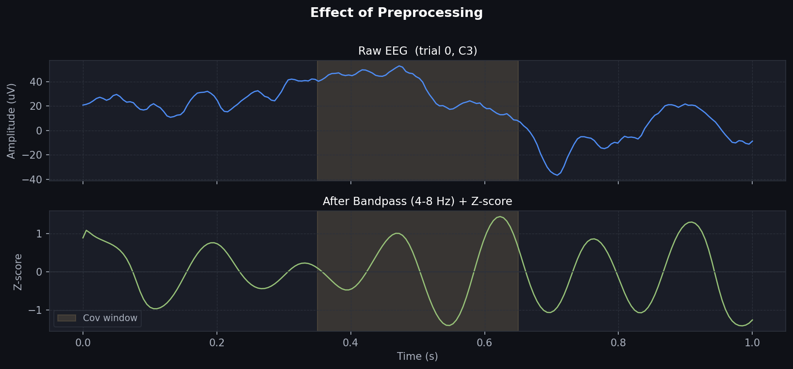
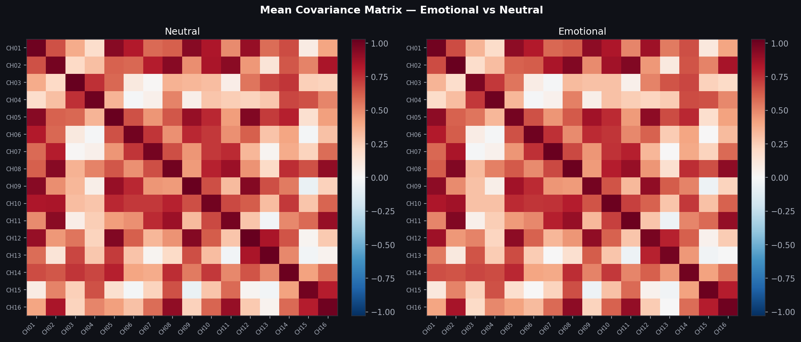
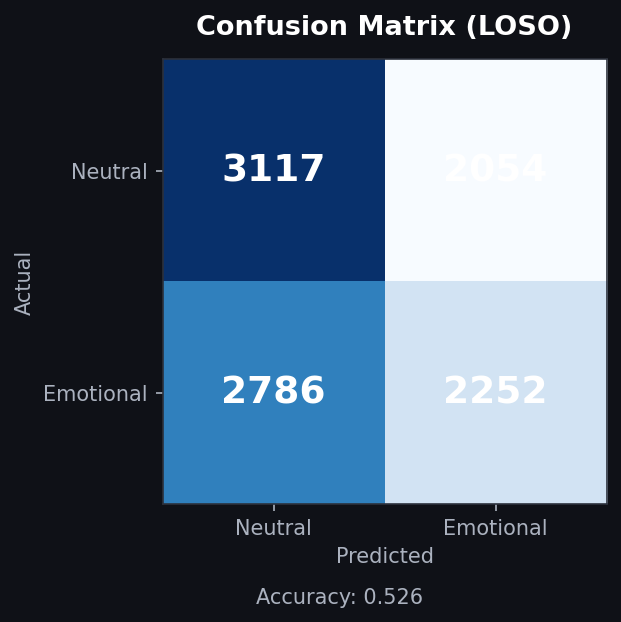

# 🧠 Model Card — EEG Emotion Classifier

> **Algorithm**: Shrinkage LDA (Ledoit-Wolf) · **Public LB AUC**: 0.557 ·
> **Task**: Binary classification — Emotional vs. Neutral memory reactivation from sleep EEG  
> **Author**: Mohamed Samy  
> **Non-Technical Story**: [What If We Could Listen to the Brain While We Sleep? (Medium)](https://medium.com/@mohamed42468/what-if-we-could-listen-to-the-brain-while-we-sleep-a76594b33696?postPublishedType=initial)  
> **PoC & Evidence**: [Scientific Papers & Citations](PoC/01_scientific_papers_and_citations.md) · [Pipeline Blueprint](PoC/02_pipeline_blueprint.md) · [Experiments & Benchmarks](PoC/03_experiments_and_benchmarks.md)

---

## ⚡ The Challenge: Listening to a Whisper in a Stadium

Imagine someone is asleep in a quiet room. Their eyes are closed, their body is completely still, and from the outside, nothing seems to be happening. 

Inside the skull, however, the brain is constantly talking. Millions of neurons fire synchronised electrical signals measured in microvolts. During wakefulness, the subject heard a specific sound paired with an emotional memory. Now, in deep non-REM sleep, we play that same sound again—using **Targeted Memory Reactivation (TMR)** like a small key to reactivate the memory while they sleep.

**The machine learning question**: *Can an algorithm look at 16 scalp electrodes and detect the footprint of that emotional memory?*

The core engineering hurdle is signal-to-noise ratio:
- **The "Crowded Room" Problem**: EEG sensors don’t record a single neuron; they record the entire stadium. Baseline sleep rhythms, eye movements, and muscle twitches reach $\sim 50\text{–}100\,\mu\text{V}$, while the cognitive emotional signal is a microscopic $\sim 0.5\,\mu\text{V}$.
- **Effect Size ($d \approx 0.02$)**: The cross-subject emotional signal has a Cohen's $d$ of 0.02–0.06—**10× weaker than what statisticians consider "small"**. 
- **The Deep Learning Trap**: When signal is this faint, complex neural architectures (EEGNet, CNNs, Transformers, EEGPT) easily memorize physiological noise and collapse to chance level.

**The winning strategy**: We avoided deep learning entirely. Guided by neuroscience literature and 340+ systematic validation experiments, we isolated the **theta rhythm (4–8 Hz)**, zeroed in on the **peak reactivation window (350–650 ms)**, extracted **spatial covariance matrices**, and applied **stability-based feature selection (136 → 75 features)** with regularized **Linear Discriminant Analysis (LDA)**. 

This classical pipeline achieved an AUC of **0.557**, securing **🥈 2nd Place** on the Kaggle competition leaderboard.

---

## 1 · Model Summary

This model classifies **emotional vs. neutral** states from 16-channel sleep-stage EEG recordings. It uses a **Linear Discriminant Analysis (LDA)** classifier with Ledoit-Wolf automatic shrinkage, trained on covariance-based spatial features extracted from the **theta frequency band (4–8 Hz)**.

### Core Pillars of the Solution

1. **Isolate the Biological Carrier** — Theta band only (4–8 Hz). All other bands (Alpha, Beta, Delta, Gamma, Spindles) added pure noise.
2. **Focus on the Reinstatement Window** — 350–650 ms post-cue (`[70:130]` samples at 200 Hz), capturing peak reactivation before consolidation spindles begin.
3. **Represent Spatial Synchrony** — Channel covariance captures inter-electrode coordination. Signal-level z-scoring mathematically makes covariance equal to correlation.
4. **Remove Noise, Don't Add Features** — Stability-based feature selection reduces 136 covariance pairs to the top 75 most reliable features across subjects.

---

## 2 · Pipeline Overview

```
┌─────────────┐    ┌──────────────┐    ┌──────────────┐    ┌──────────────┐
│  Raw EEG    │───▶│  Bandpass    │───▶│  Z-Score     │───▶│  Window      │
│  16ch×200tp │    │  θ 4–8 Hz   │    │  per subject │    │  [70:130]    │
└─────────────┘    └──────────────┘    └──────────────┘    └──────┬───────┘
                                                                  │
┌─────────────┐    ┌──────────────┐    ┌──────────────┐    ┌──────▼───────┐
│  Broadcast  │◀───│  Shrinkage   │◀───│  Select      │◀───│  Covariance  │
│  200 tp     │    │  LDA         │    │  Top K=75    │    │  16×16 → 136 │
└──────┬──────┘    └──────────────┘    └──────────────┘    └──────────────┘
       │
       ▼
  submission.csv
```

### Signal Preprocessing & Brain Connectivity


*Figure 1: Raw EEG trace vs. 4th-order Butterworth bandpass (4–8 Hz) and per-subject z-score normalization.*


*Figure 2: Average 16×16 spatial covariance patterns across all channels for Emotional vs. Neutral trials.*

---

## 3 · Quickstart & Usage

### Reproducing the Complete Pipeline

To run the entire pipeline end-to-end (data loading, preprocessing, LOSO cross-validation, training the final model, generating all diagnostic figures in `reports/`, and exporting `submission.csv`):

```bash
ml_env\Scripts\python.exe src/pipeline.py
```

### Standalone Inference Snippet

```python
import numpy as np
import joblib
from scipy.signal import butter, filtfilt

# 1. Load model artifacts
lda_model = joblib.load('lda_model.pkl')
best_mask = np.load('best_mask.npy')  # Boolean array of length 136 (75 True)

# 2. Bandpass filter helper (theta: 4-8 Hz)
def bandpass(data, lo=4, hi=8, fs=200, order=4):
    b, a = butter(order, [lo / (0.5 * fs), hi / (0.5 * fs)], btype='band')
    return filtfilt(b, a, data, axis=-1)

# Input shape: (n_trials, 16, 200) raw EEG at 200 Hz
# Step A: Bandpass filter
filtered = bandpass(raw_eeg)

# Step B: Signal-level z-score (per subject across trials)
filt_z = (filtered - filtered.mean(axis=(0, 2), keepdims=True)) / filtered.std(axis=(0, 2), keepdims=True)

# Step C: Extract covariance from [70:130] window (350-650 ms)
window_data = filt_z[:, :, 70:130]
covs = np.einsum('ijk,ilk->ijl', window_data, window_data) / 60.0

# Step D: Extract upper-triangle features (136 features)
triu_idx = np.triu_indices(16)
feats = covs[:, triu_idx[0], triu_idx[1]]

# Step E: Feature-level z-score & stability mask selection (75 features)
feats_z = (feats - feats.mean(axis=0)) / (feats.std(axis=0) + 1e-8)
feats_sel = feats_z[:, best_mask]

# Step F: Predict emotional probability
probabilities = lda_model.predict_proba(feats_sel)[:, 1]
```

| Property | Value |
|---|---|
| **Input shape** | `(n_trials, 16, n_timepoints)` — 16 EEG channels at 200 Hz |
| **Output shape** | `(n_trials,)` — probability scores between 0 (neutral) and 1 (emotional) |

> [!WARNING]
> **Strict Pipeline Dependency**: The model requires the exact preprocessing sequence (Theta Butterworth $\to$ Signal Z-score $\to$ Covariance $\to$ Feature Z-score $\to$ Masking). Feeding raw EEG or different filter bands will result in chance predictions.

---

## 4 · System Requirements & Compute

### Runtime Dependencies
- **Python**: 3.8+
- **Core packages**: `numpy`, `scipy`, `scikit-learn`, `h5py`, `pandas`, `matplotlib`
- **Input format**: HDF5 `.mat` files (16 channels @ 200 Hz)

### Hardware Footprint
| Metric | Benchmark Value |
|---|---|
| **Training Time** | ~60 seconds on a single CPU core |
| **Inference Latency** | <10 ms per subject (~40 trials) |
| **Memory Usage** | <500 MB RAM |
| **GPU / Accelerators** | **Not required** (pure CPU execution) |

---

## 5 · Model Architecture & Feature Stability

| Property | Specification |
|---|---|
| **Algorithm** | Linear Discriminant Analysis (LDA) |
| **Solver** | `lsqr` with automatic Ledoit-Wolf shrinkage |
| **Raw Covariance Features** | 136 (upper triangle of 16×16 channel matrix) |
| **Selected Features** | 75 (selected via stability metric) |
| **Artifact Sizes** | Model: ~47 KB (`lda_model.pkl`) · Mask: <1 KB (`best_mask.npy`) |

### Combined Stability Score

To prevent overfitting on noisy features, we scored each of the 136 covariance pairs across all 14 Leave-One-Subject-Out folds:

$$\text{Stability Score} = \text{Sign Agreement} \times \frac{\text{Mean } |\text{Coefficient}|}{\text{Coefficient of Variation} + \varepsilon}$$

| Component | What It Measures |
|---|---|
| **Sign Agreement** | Did all LOSO folds agree on whether this channel pair correlates with emotionality? |
| **Mean Absolute Coef** | How heavily does LDA weight this channel pair? |
| **Coefficient of Variation** | How stable is the weight across different subjects? |


*Figure 3: Feature stability scores sorted across all 136 covariance pairs. Top K=75 features are retained; 61 unstable pairs are discarded.*

---

## 6 · Data Overview & The "Polarity Reversal" Trap

### Dataset Breakdown
- **Source**: Kaggle Competition dataset (HDF5 `.mat` format).
- **Setup**: 14 training subjects performing emotional vs. neutral memory reactivation during sleep.
- **Total trials**: 10,209 trials (5,038 emotional + 5,171 neutral).
- **Test set**: 3 unseen subjects (zero-shot evaluation).

### The Within-Subject Polarity Trap

One of the most dangerous traps in this dataset was the **within-subject signal direction reversal**:
- Within a single subject, the difference between emotional and neutral is relatively strong ($d \approx 0.3–0.5$).
- However, **the polarity reverses across individuals**:
  - **Group A (8 subjects)**: Emotional amplitude > Neutral amplitude.
  - **Group B (6 subjects)**: Emotional amplitude < Neutral amplitude.

A naive global model averages these opposing directions and cancels out to 50% chance. Our pipeline overcomes this through **per-subject signal-level and feature-level z-scoring**, aligning relative channel correlations rather than raw amplitudes.

---

## 7 · Evaluation Results

### Cross-Validation & Competition Leaderboard

The model was evaluated using **Leave-One-Subject-Out (LOSO)** cross-validation across all 14 training subjects. Each fold holds out an entire individual to guarantee zero cross-subject data leakage:

| Metric | Score | Notes |
|---|---|---|
| **LOSO Cross-Validation AUC** | **0.5335** | Evaluated on full unseen subjects |
| **Public Leaderboard AUC** | **0.557** | Evaluated on 3 held-out competition test subjects |
| **Final Competition Rank** | **🥈 2nd Place** | Classical ML outperforming all deep learning entries |


*Figure 4: Leave-One-Subject-Out (LOSO) AUC across each of the 14 individual subjects.*


*Figure 5: Out-of-fold validation confusion matrix across all 10,209 trials.*

### The LOSO–Leaderboard Anti-Correlation Discovery

During experimentation, we discovered a counter-intuitive phenomenon: **6 out of 7 modifications that increased LOSO cross-validation actually decreased the public leaderboard score**. 

The only modification that improved **both LOSO and Leaderboard simultaneously** was **feature pruning via the Stability Score (K=136 → K=75)**. Removing noise was the only genuine path to generalizable learning.

---

## 8 · Benchmark: Classical ML vs. Deep Learning

Across 340+ systematic experiments, all linear regularized classifiers performed near parity, whereas complex non-linear models failed:

| Model Architecture | Validation AUC | Public LB | Why It Succeeded or Failed |
|---|---|---|---|
| **Shrinkage LDA (auto) ★** | **0.5335** | **0.557** | **Optimal covariance regularization; closed-form solution.** |
| Logistic Regression ($L_2$) | 0.5370 | 0.555 | Linear boundary performs similarly with proper penalty. |
| Ridge Classifier | 0.5370 | 0.555 | Closed-form linear model; robust to collinearity. |
| Linear SVM ($C=0.01$) | 0.5370 | 0.555 | Maximizes margin on regularized features. |
| Random Forest / XGBoost | ~0.505 | 0.510 | Memorizes noise and subject quirks at $d \approx 0.02$. |
| EEGNet / 1D-CNN | ~0.502 | 0.508 | Convolutional kernels overfit to individual subjects. |
| BiLSTM / Transformers | ~0.498 | 0.501 | Data volume insufficient for temporal attention at this SNR. |
| EEGPT / Foundation Models | ~0.501 | 0.503 | Pre-trained representations do not transfer to weak sleep TMR. |

---

## 9 · Limitations & Ethical Considerations

### Scope & Constraints
- **Paradigm Specificity**: Trained specifically on Targeted Memory Reactivation during sleep. It does not generalize to active awake tasks, motor imagery, or P300 paradigms.
- **Electrode Configuration**: Calibrated for standard 16-channel EEG @ 200 Hz. Re-montaging or different electrode positions require retraining the covariance feature mask.
- **Research Scope**: Developed as an academic competition solution; not certified or intended for clinical diagnostics or medical sleep staging.

### Ethical Safeguards
- **Privacy & Demographics**: The training data contains zero demographic identifiers (age, gender, ethnicity) and no personally identifiable information (PII).
- **Prohibited Uses**: This model must **never** be deployed for clandestine emotion surveillance, cognitive monitoring, deception detection, or any application compromising individual mental privacy or autonomy.
